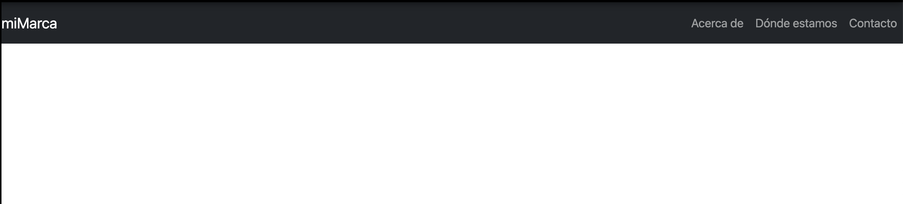
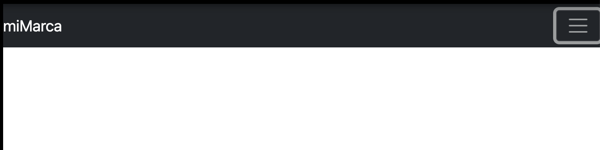
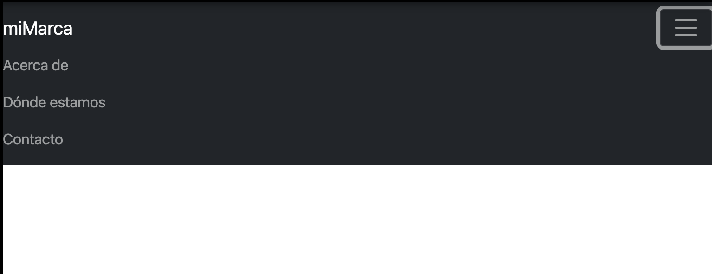

# Bootstrap

## Introducción

[Bootstrap](https://getbootstrap.com/) es una biblioteca de recursos CSS y Javascript que nos permite realizar desarrollos de front-end con muy poco esfuerzo y sin necesidad de conocimientos de bajo nivel en dichos lenguajes.

Fue creado por Twitter inicialmente y posteriormente liberado como código abierto. Actualmente, con cerca de 161k *starts*, es uno de los proyectos más detacados en [GitHub](https://github.com/twbs/bootstrap/).

Bootstrap cuenta con un gran número de estilos que permiten la realización de diseños responsives, estilos para la creación de menús, formularios, tablas, botones, etc. 

## Instalación

Para poder utilizar Bootstrap en nuestros proyectos no es necesario descargar el código fuente. Bastará con copiar y pegar en nuestro HTML la plantilla que se muestra en [la siguiente URL](https://getbootstrap.com/docs/5.3/getting-started/introduction/#quick-start) y comenzar a editar nuestra página a partir de dicha plantilla.

**Es importante** tener en cuenta que Bootstrap requiere la declaración del elemento `doctype`, ya que sin él es posible que algunos estilos no se muestrn corretamente:

    <!doctype html>
    <html lang="en">
    ...
    </html>

Otra forma de utilizar Bootstrap en nuestros proyectos es descargarnos el código fuente ([Compiled CSS and JS](https://www.w3schools.com/cssref/css3_pr_text-shadow.php)) e incluirlo en nuestros ficheros mediante `<link rel="stylesheet" href="./css/bootstrap.css">`. En este caso, el fichero no se cacheará en el navegador y en la mayoría de los casos será necesario descargarlo, lo cual ralentizará un poco más la carga.

## Barras de navegación (navbar)

[https://getbootstrap.com/docs/5.3/components/navbar](https://getbootstrap.com/docs/5.3/components/navbar)

Para crear una barra de navegación básica en Bootstrap, utilizaremos el elemento HTML [nav](https://developer.mozilla.org/es/docs/Web/HTML/Element/nav). En él, alojaremos una lista no numerada donde cada uno de sus ítems será un enlace con cada una de las opciones del menú.

Si no hacemos uso de Bootstrap, la lista se mostrará de la forma tradicional. Para convertirla en una barra de navegación utilizaremos las siguientes clases:
* nav - navbar (Podfemos visualizar sus propiedades y valores a través del código fuente de Bootstrap)
* ul - navbar-nav
* li - nav-item
* a - nav-link

Esto creará una barra de navegación en vertical. Pero en nuestro caso queremos crear una barra horizontal que situaremos en el encabezado de nuestra web y para ello haremos uso de la clase `.navbar-expand{-sm|-md|-lg|-xl|-xxl}` tal y como se detalla en la documentación oficial. Esta clase nos permite colocar la barra de navegación en horizontal, pero que cambiará su estructura si el dispositivo es más estrecho. Podemos probarlo (por ejemplo, en codeply) modificando el viewport mediante los enlaces que se muestran en la parte inferior de la ventana. Podemos observar de esta forma las diferencias entre -md, -lg, -sm...

Para añadirle un color de fondo a la barra de navegación podemos utilizar la clase `bg-light`, por ejemplo.

Haciendo uso de la clase `navbar-light` podemos cambiar el color de los enlaces por un color más acorde al fondo anterior. Para visualizar la gama de colores que se pueden utilizar, podemos visitar la documentación de los [botones](https://getbootstrap.com/docs/5.3/components/buttons/), donde se incluyen varias imágenes que nos permiten apreciarlos de forma más visual.

Una combinación valida podría ser también `navbar-dark bg-dark`, por ejemplo.

Podemos añadir el nombre de nuestra empresa añadiendo un elemento `<a>` asociado a la clase `navbar-brand` dentro del `<nav>`.

Si quisiéramos dejar a la izquierda el nombre de nuestra empresa y a la derecha todas las opciones del menú podríamos hacer uso de las clases que se documentan en [Utilities-Spacing](https://getbootstrap.com/docs/5.3/utilities/spacing/#notation). En concreto en este caso utilizaremos `ms-auto` en el elemento `<ul>`, lo cual añade todo el margen posible al inicio del elemento (izquierda en nuestro caso).

Si observamos cómo se adapta el menú a tamaños más pequeños de la pantalla podemos ver que quizás no se ajute a lo que estamos acostumbrados a ver en Internet. Vamos a ver cómo podemos crear un [menú tipo 'hamburguesa'](https://www.irudigital.com/menu-hamburguesa/), que se genere cuando disminuimos el ancho de la pantalla. Esto lo podemos hacer con [toggler](https://getbootstrap.com/docs/5.3/components/navbar/#toggler). 

Para ello vamos a utilizar el código fuente que se muestra en el ejemplo de la URL anterior. A grandes rasgos, tenemos que hacer lo siguiente:
* Crear un `
` donde incluyamos todo el contenido 'collapsable' (en nuestro caso, el elemento `<ul>`).
* Asignarle un "id" a dicho `
`.
* Asociarle las clases "collapse navbar-collapse" a dicho `
`.
* Crear un elemento `<button>` de tipo(type) "button" y de la clase "navbar-toggler" justo antes del `
` anterior. 
* Añadirle a dicho botón el atributo "data-bs-target" y asignarle como valor el id asignado al div anterior, precedido por una "#".
* Incluir los siguientes atributtos al elemento `<button>`: `data-bs-toggle="collapse" aria-controls="navbarTogglerDemo01" aria-expanded="false" aria-label="Toggle navigation"`
* Crear, dentro del elemento `<button>` un ``con el siguiente contenido: ``.

<!--
El código fuente con las especificaciones anteriores se incluye a continuación:

    <button class="navbar-toggler" type="button" data-bs-toggle="collapse" data-bs-target="#navbarTogglerDemo01" aria-controls="navbarTogglerDemo01" aria-expanded="false" aria-label="Toggle navigation">
      
    </button>
-->

El resultado obtenido tras la configuración anterior se muestra a continuación:

También se pueden crear en la navbar un dropdown link, mantenerlo fijo en la parte superior...