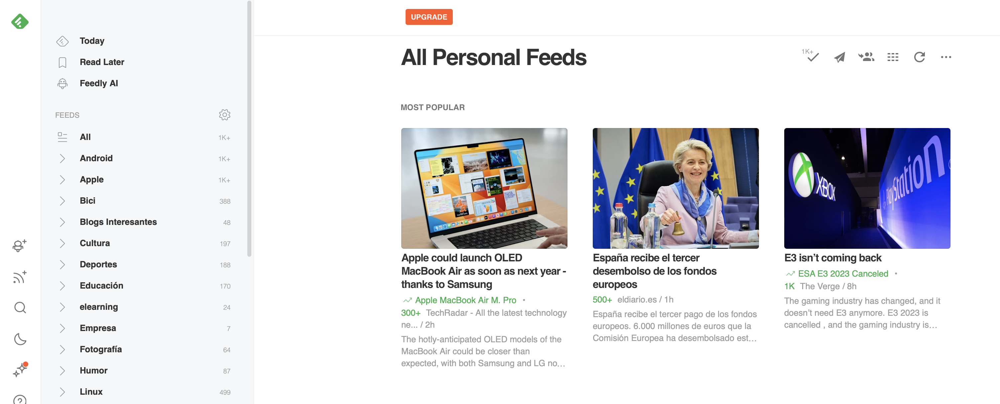

- [Sindicación de contenidos](#sindicación-de-contenidos)
  - [Introducción](#introducción)
  - [Feeds o canales de contenido](#feeds-o-canales-de-contenido)
  - [Lectores de feeds](#lectores-de-feeds)
  - [Creación de feeds](#creación-de-feeds)
  - [Tecnologías de creación de canales de contenidos](#tecnologías-de-creación-de-canales-de-contenidos)
- [El estándar RSS](#el-estándar-rss)
  - [Ejemplo de RSS](#ejemplo-de-rss)
  - [Validación](#validación)

# Sindicación de contenidos

## Introducción

La **sindicación de contenidos** es una técnica que permite **distribuir contenido web**, como noticias, artículos, videos, entre otros, a través de diferentes medios y plataformas. En este proceso, los propietarios de contenido ofrecen sus publicaciones a otros sitios web, aplicaciones o servicios en línea para que puedan mostrar ese contenido en sus propias plataformas.

La sindicación de contenidos se realiza mediante el uso de un formato de archivo específico. Los más usados son **RSS** (Really Simple Syndication) y **Atom**. Los archivos con dichos formatos permiten que los usuarios se suscriban y reciban actualizaciones automáticas cada vez que se publique nuevo contenido en el sitio original.

Este proceso de distribución de contenido puede ser beneficioso tanto para los creadores de contenido como para los sitios web o personas que lo reciben, ya que permite una mayor difusión de la información y un alcance a una audiencia más amplia. Además, la sindicación de contenidos puede ayudar a generar tráfico hacia el sitio original y a mejorar el posicionamiento en motores de búsqueda.

## Feeds o canales de contenido

Los servicios que ofrece el sitio web original, junto con los metadatos que tiene asociados en el sitio original, forman los **feeds o canales de contenidos**. Tenemos un ejemplo en el feed del diario El País en la siguiente URL: [https://feeds.elpais.com/mrss-s/pages/ep/site/elpais.com/portada](https://feeds.elpais.com/mrss-s/pages/ep/site/elpais.com/portada).

¿Conoces algún otro? ¿Podrías localizar el feed de la web del IES El Rincón? ¿Y algún otro que te pueda resultar de interés?

## Lectores de feeds

Para leer una fuente, o canal, hay que suscribirse a ella utilizando un **agregador de contenido**, que no es más que una aplicación o servicio en línea que recopila información de uno o varios feeds y la presenta en un solo lugar para que los usuarios puedan acceder a ella de forma mucho más cómoda.

Un agregador de contenido puede funcionar de varias formas. Algunos utilizan algoritmos para recopilar contenido relevante de diversas fuentes en función de las preferencias del usuario. Otros permiten a los usuarios suscribirse a feeds RSS o Atom de sitios web o blogs específicos y presentan el contenido actualizado en una sola página. Algunos agregadores de contenido también pueden permitir a los usuarios compartir contenido con otros y agregar sus propias fuentes.

Podemos utilizar como agregador de contenido, por ejemplo, el que nos proporciona de forma nativa el navegador Brave ([Brave News](https://brave.com/es/brave-news/)), o el conocido [Feedly](https://feedly.com/). En la [siguiente web](https://es.wired.com/articulos/mejores-lectores-de-feeds-rss) tenemos un pequeño análisis de algunos de los más conocidos/utilizados en la actualidad.

## Creación de feeds

Podemos hacer que una web se convierta en suministradora (origen) de un feed, de modo que esta información pueda ser leída por un agregador de contenido o una aplicación. Para lograrlo, en la cabecera HTML de la página web hay que incluir un enlace al fichero donde está definido el canal de contenidos.

Para hacerlo, hay que usar una de las dos líneas siguientes, dependiendo de que el canal esté implementado con el estándar **RSS**:

    <link rel="alternate" type="application/rss+xml" title="titulo_que_tendrá_el_enlace" href="http://www.misitio.com/fichero.rss" />

O bien, con **Atom**:

    <link rel="alternate" type="application/atom+xml" title="titulo_que_tendrá_el_enlace" href="http://www.misitio.com/fichero.atom" />

La creación de feeds resulta interesante para aquellos sitios web que se actualizan con frecuencia. De lo contrario su utilidad es muy reducida.

## Tecnologías de creación de canales de contenidos

Los estándares más utilizados se clasifican en dos grupos:

* **RSS:** (Really Simple Syndication) es parte de la familia de los formatos XML, desarrollado para compartir la información que se actualiza con frecuencia entre sitios web. Además se utiliza para:
    * Conectar con sistemas de mensajería instantánea. Conversión RSS en mensajes de correo electrónico. 
    * Transformar los enlaces favoritos del navegador en RSS.

* **Atom:** fue publicado como un estándar propuesto por el grupo de trabajo Atom Publishing Format and Protocol (Formato y protocolo de publicación Atom) de la IETF en el RFC4287. Se desarrolló como una alternativa a RSS, con el fin de evitar la confusión creada por la existencia de estándares similares para la sindicación de contenidos, entre los que existía cierta incompatibilidad. En lugar de sustituir a los estándares existentes, se creó un nuevo estándar que convive con ellos. Se caracteriza por su flexibilidad. Atom permite tener un mayor control sobre la cantidad de información a representar en los agregadores.

# El estándar RSS

El documento RSS incluye como primera linea la declaración del documento XML, normalmente:
    
    <?xml version="1.0" encoding="UTF-8"?>

En él se especifica la versión de XML utilizada en el fichero y la codificación de caracteres empleada. 

La siguiente línea contiene declaración de que estamos trabajando con un fichero RSS y la versión correspondiente:

    <rss version="2.0">

La última versión de RSS actualmente es la 2.0 (2003).

A continuación, dentro de la etiqueta anterior se incluyen los canales que contienen la información del feed. Cada canal comienza con la etiqueta `<channel>` y contiene tres elementos hijo obligatorios:

* `<title>` - Define el título del canal 
* `<link>` - Define el hiperenlace al canal 
* `<description>` - Describe el canal

También hay varios elementos opcionales. Algunos de ellos son:

* `<language>` - Define el idioma del canal
* `<category>` - Define una o más categorías a las que pertenece la fuente

Cada canal tiene uno o más artículos o secciones (etiqueta <item>), cada uno de los cuales cuenta "una historia" del canal. Tiene tres elementos hijos obligatorios:

* `<title>` - Define el título del artículo 
* `<link>` - Define el hiperenlace al artículo
* `<description>` - Describe el artículo
  
También hay varios elementos opcionales. Algunos de ellos son:
* `<author>` - Define el autor del artículo
* `<category>` - Define una o más categorías a las que pertenece la fuente 
* `<guid>` - Define un identificador único para el elemento

## Ejemplo de RSS

A continuación mostramos un ejemplo de un fichero RSS simple, con un canal y dos ítems en dicho canal:

    <?xml version="1.0" encoding="UTF-8" ?>
    <rss version="2.0">
      <channel>
        <title>W3Schools Home Page</title>
        <link>https://www.w3schools.com</link>
        <description>Free web building tutorials</description>
        <item>
          <title>RSS Tutorial</title>
          <link>https://www.w3schools.com/xml/xml_rss.asp</link>
          <description>New RSS tutorial on W3Schools</description>
        </item>
        <item>
          <title>XML Tutorial</title>
          <link>https://www.w3schools.com/xml</link>
          <description>New XML tutorial on W3Schools</description>
        </item>
      </channel>
    </rss>

En la dirección [https://boe.es/rss/boe.php](https://boe.es/rss/boe.php) podemos encontrar un ejemplo de RSS con la información para el último BOE publicado.

El elemento raíz es `<rss>`. Tiene un único hijo, channel, que define el canal de noticias. Como hijos de este elemento hay varios elementos item, uno por cada noticia publicada en el canal.

Para cada item, hay un título (title), un vínculo (link), una descripción (descripción), una o más categorías (category), un elemento guid y una fecha de publicación (pubDate).

El primer elemento item es el sumario, como se puede ver en el título, la descripción y la categoría.

En este caso los elementos elemento guid y link coinciden. Si se accede a esa URL en el navegador, se encuentra, efectivamente, el sumario del BOE para esa fecha.

El resto de elementos item se corresponden con los artículos publicados ese día.

Tienen dos elementos category y los elementos link y guid no son iguales.

El elemento link contiene un vínculo que lleva a una página con el contenido en HTML. 

El elemento guid lleva a la versión en PDF del mismo contenido.

## Validación

En internet hay múltiples lugares que dan este servicio.

Para validar un documento RSS con uno de estos validadores, se le da la dirección del fichero donde se encuentra alojado y comprueba que lo pueden encontrar, es decir que la URI es válida, y que no contiene errores.

Una vez validado, suelen ofrecer una imagen del tipo "XML" o "RSS", de color naranja por lo general, que se puede incluir en la página principal, para enlazar a la dirección del fichero alojado en su dominio. Así, cuando un visitante pulse sobre este pequeño icono, accederá directamente al contenido actual de la fuente y podrá navegar a través de él a las páginas que más le interesen.

Algunos de estos servicios de validación también ofrecen imágenes que se pueden incluir en la página para que cualquier visitante compruebe que el canal es válid

Algunos de los validadores que podemos encontrar en Internet son:

* [FeedValidator](http://feedvalidator.org/)
* [W3C Feed Validation Service mediante URI](http://validator.w3.org/feed/#validate_by_uri)
* [W3C Feed Validation Service mediante código](http://validator.w3.org/feed/#validate_by_input)
* [RSS Advisory Board](http://www.rssboard.org/rss-validator/)
* [Googletransitdatafeed](https://github.com/google/transitfeed/wiki/FeedValidator)
